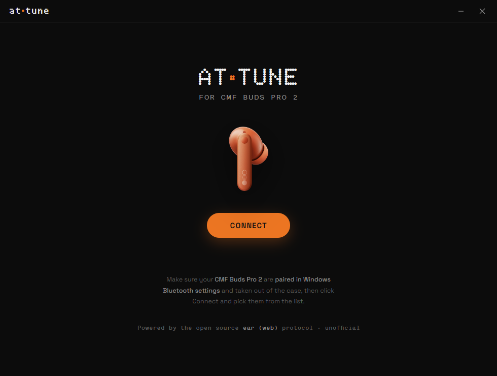
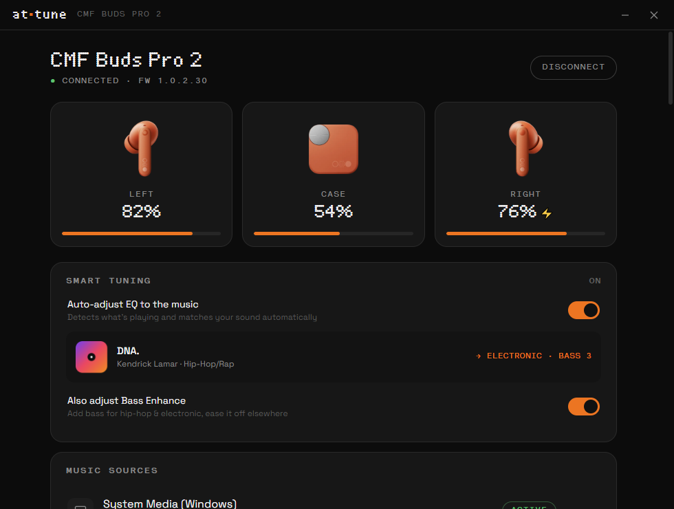
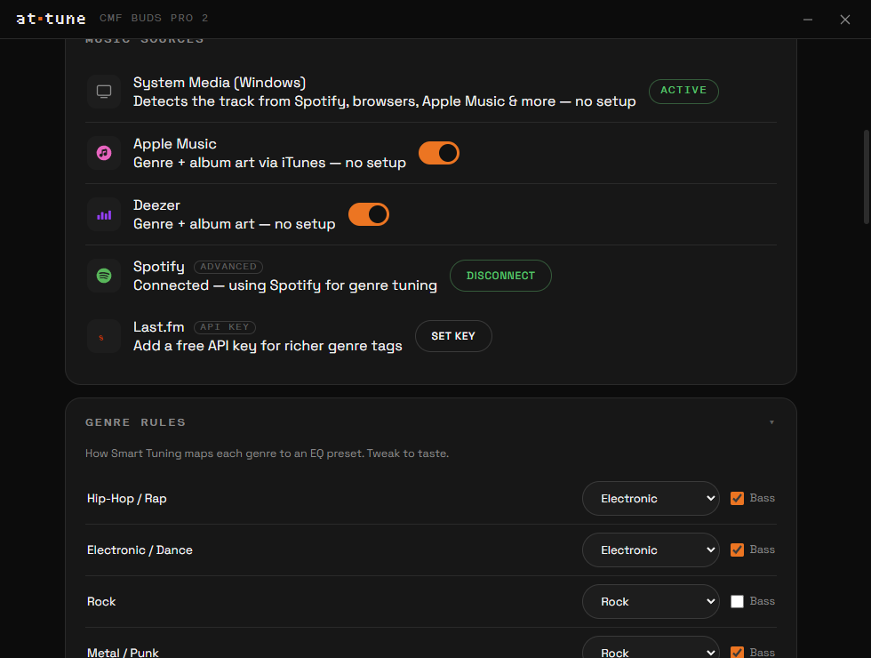

<div align="center">

# Attune

**Desktop control + smart auto-EQ for CMF Buds Pro 2 (and other Nothing / CMF earbuds).**

A clean, CMF-themed Windows app that does what the [ear (web)](https://earweb.bttl.xyz/)
site does — battery, ANC, EQ, gestures and more — over Bluetooth, plus a **Smart Tuning**
mode that auto-matches your EQ to whatever music is playing.

 

</div>

> ⚠️ Unofficial — not affiliated with, sponsored by, or endorsed by Nothing Technology.
> Releases are **unsigned**: on first launch Windows SmartScreen may say "Windows protected
> your PC" → **More info ▸ Run anyway**.

## Features

- **Full device control** — battery for left / right / **case**, ANC (Off / Transparency /
  Noise Cancellation with Low · Mid · High · Adaptive), EQ presets, custom 3-band EQ,
  Advanced EQ, Bass Enhance, In-Ear Detection, Low-Latency mode, gesture customization,
  ear-tip fit test, find-my-buds, and firmware version. Battery is polled continuously, so
  the **case percentage shows up as soon as you dock the buds**.
- **Smart Tuning** *(off by default)* — detects the song playing in **any** app (Spotify,
  browsers, Apple Music…) via Windows System Media, looks up its genre + **album art**, and
  auto-sets the EQ (and optionally Bass). ANC stays manual on purpose.
- **Editable rules** — a **Genre Rules** editor (13 genres → your choice of EQ + bass) and
  **per-artist overrides** that beat the genre rule.
- **Music sources** — *System Media (Windows)* needs zero setup; **Apple Music** and
  **Deezer** add genre + cover art with no login; **Spotify** and **Last.fm** can be
  connected for richer data.
- **Earbud colour + theme** — pick your colourway; the bud art **and** the whole app accent
  recolour to match.
- **Runs in the background** — closing the window minimizes to the system tray so Smart
  Tuning keeps working; quit from the tray.
- **In-app feedback** — opens a pre-filled GitHub issue (and keeps a local copy).

<div align="center">

</div>

## Install / run

Grab a build from `dist/` (or the Releases page once published):

- **`Attune Setup 1.2.0.exe`** — installer (Start Menu + Desktop shortcuts).
- **`Attune-Portable.exe`** — no install, just double-click.

### Before connecting
1. **Pair the CMF Buds Pro 2 in Windows** → Settings ▸ Bluetooth & devices ▸ Add device.
2. Take the buds **out of the case** so they're awake.
3. Launch Attune, click **Connect**, and pick the buds from the chooser.

### Optional connections
- **Spotify** — Music Sources ▸ Spotify ▸ Connect → make a free app at
  [developer.spotify.com/dashboard](https://developer.spotify.com/dashboard), add redirect
  URI `http://127.0.0.1:8888/callback`, paste the Client ID.
- **Last.fm** — paste a free key from [last.fm/api](https://www.last.fm/api/account/create).

## Build from source

Requires Node.js 18+ on Windows.

```bash
npm install      # Electron + electron-builder
npm start        # run in dev
npm run dist     # build installer + portable into dist/
```

Dev-only env vars: `CMF_SMOKE=1`, `CMF_DEMO=1`, `CMF_SHOT=path.png`, `CMF_BLUE=1`, `CMF_SCROLL=<px>`.

## How it works

| File | Role |
|------|------|
| `src/main/main.js` | Electron main; frameless window; tray + close-to-tray; **`select-serial-port`** auto-picks the Bluetooth SPP port; settings + feedback IPC. |
| `src/main/media.js` | Smart Tuning backend: Windows SMTC detection (PowerShell), genre + album-art lookup (Apple / Deezer / Last.fm / Spotify), Spotify PKCE OAuth. |
| `src/main/preload.js` | Context-isolated bridge (no Node in the renderer). |
| `src/renderer/protocol.js` | Byte-level CMF/Nothing protocol (framing, CRC-16, handshake, all commands, battery polling), ported from `ear-web`. |
| `src/renderer/app.js` | The UI + Smart Tuning rules engine + genre/artist editors. |
| `src/renderer/index.html` · `theme.css` | The CMF-themed single-page interface. |
| `build/make-icon.js` | Generates the app icon (Electron-rasterized SVG → multi-size `.ico`). |

**Notes**
- Smart Tuning's media detection uses **Windows PowerShell 5.1** (it projects the WinRT
  System Media APIs; PowerShell 7 cannot). All network/OS access happens in the main process
  so the renderer stays sandboxed (locked-down CSP, no remote requests; album art is passed
  in as a `data:` URL).
- The protocol layer recognizes many Nothing/CMF models; the UI shows the controls each
  model supports. Smart Tuning's EQ presets are tuned for **CMF Buds Pro 2** (model `B172`).

## Credits

Built on the open-source [`radiance-project/ear-web`](https://github.com/radiance-project/ear-web)
protocol by RapidZapper & Bendix. Earbud/product names and assets belong to Nothing
Technology Limited.

## License

[AGPL-3.0](LICENSE) — matching the upstream `ear-web` project.
